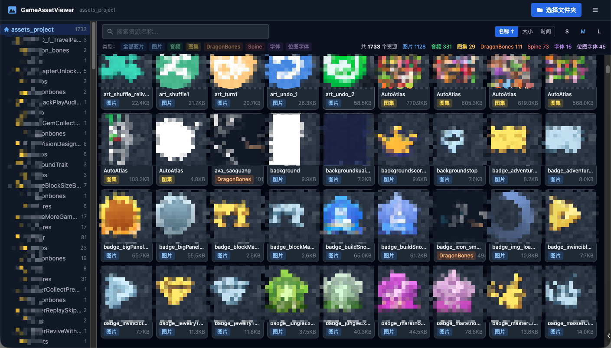

# AssetsPreview

一个**纯前端**游戏资源预览工具，无需后端服务、无需安装，直接在浏览器中读取本地游戏资源文件夹，实现全类型资源的可视化浏览与播放。

**🔗 在线体验：[https://www.youxiheai.xin/project/asset-viewer](https://www.youxiheai.xin/project/asset-viewer)**



## 功能特性

| 资源类型 | 支持能力 |
|---|---|
| 图片（PNG / JPG / WebP 等）| 缩放 / 平移预览，25%–400% |
| 音频（MP3 / OGG / WAV 等）| 卡片内快捷播放 + 完整播放器（进度条 / 音量 / 循环） |
| 图集（Plist）| 全图预览 + 子 Sprite 列表，支持旋转帧 |
| DragonBones（_ske.json + _tex.json + _tex.png）| PixiJS 实时播放，动画切换，速度控制，拖拽 / 缩放 |
| Spine JSON（.json + .atlas + .png）| PixiJS 实时播放，支持 3.7 / 3.8 / 4.0 / 4.1 全版本，动画 / 皮肤切换，拖拽 / 缩放 |
| Spine 二进制（.skel + .atlas + .png）| 同上，自动识别版本，支持二进制格式 |
| TTF / OTF / WOFF 字体 | FontFace API 动态加载，多尺寸字样预览 |
| BMFont（.fnt + .png）| Canvas 渲染，自定义文字输入 |

**通用功能：**
- 文件夹选取（File System Access API，支持大型项目 8000+ 文件）
- 目录树导航 + 按资源类型过滤
- 模糊搜索（Fuse.js）
- 排序（名称 / 大小 / 时间，升降序）
- 右键菜单：复制相对路径 / 文件名
- 骨骼动画查看器：自动居中适配、拖拽移动、滚轮缩放、双击重置
- 构建为**单个 HTML 文件**，可离线使用

## 技术栈

- [Vue 3](https://vuejs.org/) + Composition API + `<script setup>`
- [Vite 5](https://vitejs.dev/) + [vite-plugin-singlefile](https://github.com/richardtallent/vite-plugin-singlefile) — 输出单文件 HTML
- [TypeScript](https://www.typescriptlang.org/)
- [UnoCSS](https://unocss.dev/) — 原子化 CSS
- [Pinia](https://pinia.vuejs.org/) — 状态管理
- [PixiJS 7](https://pixijs.com/) — DragonBones / Spine 渲染后端
- [pixi-spine 4](https://github.com/pixijs/spine) — Spine 3.7 / 3.8 / 4.0 / 4.1 全版本运行时
- [@md5crypt/dragonbones-pixi](https://github.com/md5crypt/dragonbones-pixi) — DragonBones 运行时
- [Fuse.js](https://www.fusejs.io/) — 模糊搜索

## 快速开始

### 依赖环境

- Node.js ≥ 18
- npm ≥ 9

### 安装与开发

```bash
npm install
npm run dev
```

浏览器打开 `http://localhost:5173`

### 生产构建

```bash
npm run build
```

产物为 `dist/index.html`（单文件），可直接双击在浏览器中打开。

## 项目结构

```
src/
├── components/          # UI 组件（文件夹选取、目录树、资源卡片等）
├── core/
│   ├── parsers/         # Plist / FNT 解析器
│   ├── assetIndex.ts    # Fuse.js 搜索索引
│   ├── fileReader.ts    # File System Access API 封装
│   └── scanner.ts       # 资源识别与扫描
├── stores/              # Pinia 状态（assetStore, previewStore）
├── types/               # TypeScript 类型定义
├── utils/               # 工具函数
└── viewers/             # 各类型预览组件
    ├── ImageViewer.vue
    ├── AudioViewer.vue
    ├── PlistViewer.vue
    ├── DragonBonesViewer.vue
    ├── SpineViewer.vue
    ├── TtfViewer.vue
    └── FntViewer.vue
```

## 浏览器兼容性

推荐使用 **Chrome 86+** 或 **Edge 86+**（需要 File System Access API）。

Firefox / Safari 降级为 `<input webkitdirectory>` 上传模式，功能相同但无法记忆上次目录。

## License

[MIT](LICENSE)
